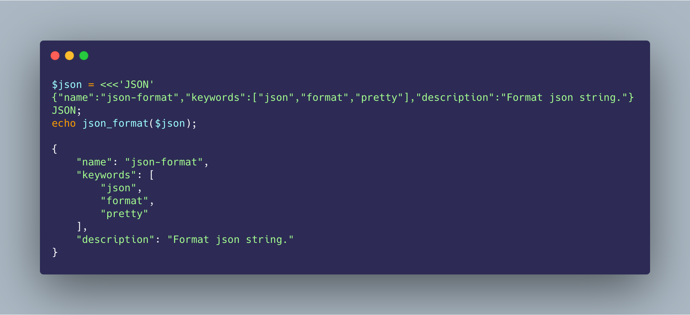

<h1 align="center">json-format</h1>

<p align="center">Format json string.</p>

<p align="center"></p>

[](https://travis-ci.org/guanguans/json-format)
[](https://scrutinizer-ci.com/g/guanguans/json-format/build-status/master)
[](https://scrutinizer-ci.com/g/guanguans/json-format/?branch=master)
[](https://codecov.io/gh/guanguans/json-format)
[](https://github.styleci.io/repos/255808426)
[](https://packagist.org/packages/guanguans/json-format)
[](https://packagist.org/packages/guanguans/json-format)
[](https://packagist.org/packages/guanguans/json-format)

## Requirements

* PHP > 5.4
* ext-json

## Installing

``` shell
$ composer require guanguans/json-format -v
```

## Usage

### Code

``` php
<?php
require __DIR__.'/vendor/autoload.php';

$json = <<<'JSON'
{"name":"json-format","keywords":["json","format","pretty"],"description":"Format json string."}
JSON;

echo json_format($json);
```

### Output

``` json
{
    "name": "json-format",
    "keywords": [
        "json",
        "format",
        "pretty"
    ],
    "description": "Format json string."
}
```

## Testing

``` shell
$ composer test
```

## License

[MIT](LICENSE)